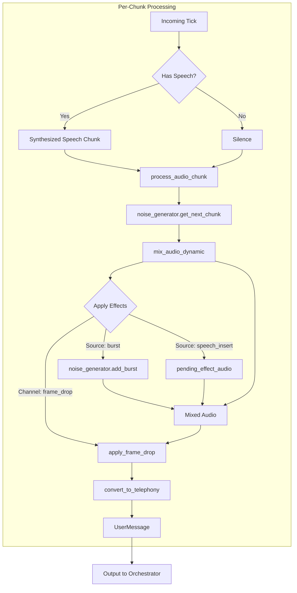

# Voice Support in Tau2

This module provides voice synthesis and transcription capabilities for the Tau2 benchmark system.

## Overview

The voice support allows:
- **Users** to synthesize their text messages into audio files
- **Agents** to transcribe received audio messages back to text

## Configuration

Voice settings are managed through the `VoiceSettings` class:

```python
from tau2.data_model.voice import VoiceSettings

# Create voice settings for enabled voice
voice_settings = VoiceSettings(
    enabled=True,
    synthesis_provider="elevenlabs",
    synthesis_config={
        "model_id": "eleven_v3",
        "enable_background_noise": True,
        "background_noise_probability": 0.5,  
        "enable_burst_noise": True,
        "burst_noise_probability": 0.3,  
        "enable_audio_tags": True,  
        "audio_tags_probability": 0.2  
    },
    transcription_model="nova-3",
    transcription_config={
        "language": "en-US",
        "punctuate": True
    },
    output_dir=Path("./audio_outputs")
)

# Or create from CLI arguments
voice_settings = VoiceSettings.from_cli_args(
    voice_enabled=True,
    voice_synthesis_provider="elevenlabs",
    voice_transcription_model="nova-3",
    output_dir=Path("./audio_outputs")
)

# Or create disabled voice settings (default)
voice_settings = VoiceSettings.disabled()
```

## Voice Synthesis Features

When voice synthesis is enabled, the following audio effects are automatically applied by default:

1. **Background Noise** (50% probability): Continuous ambient sounds like car interior, people talking, train noise
2. **Burst Sounds** (30% probability): Short sound effects like door closing, baby crying, sirens  
3. **Audio Tags** (20% probability, v3 models only): Vocal interruptions like [cough], [sneeze], [sniffle]

These effects simulate realistic telephony conditions for testing voice systems. All probabilities and features can be configured via `synthesis_config`.

## Usage

### Command Line

To run a simulation with voice enabled:

```bash
# Basic voice-enabled simulation
tau2 run --domain airline --voice-enabled

# Customize background noise probabilities
tau2 run --domain airline --voice-enabled \
  --voice-background-noise-prob 0.8 \
  --voice-burst-noise-prob 0.5 \
  --voice-audio-tags-prob 0.3

# Disable specific audio effects
tau2 run --domain airline --voice-enabled \
  --no-voice-background-noise \
  --no-voice-burst-noise

# Completely clean audio (no effects)
tau2 run --domain airline --voice-enabled \
  --no-voice-background-noise \
  --no-voice-burst-noise \
  --no-voice-audio-tags
```

### CLI Options for Voice Effects

- `--voice-background-noise-prob`: Probability of background noise (0.0-1.0, default 0.5)
- `--voice-burst-noise-prob`: Probability of burst sounds (0.0-1.0, default 0.3)
- `--voice-audio-tags-prob`: Probability of audio tags (0.0-1.0, default 0.2)
- `--no-voice-background-noise`: Disable background noise
- `--no-voice-burst-noise`: Disable burst sounds
- `--no-voice-audio-tags`: Disable audio tags

### Environment Variables

The voice providers require API keys to be set as environment variables:

```bash
export ELEVENLABS_API_KEY="your-elevenlabs-api-key"
export DEEPGRAM_API_KEY="your-deepgram-api-key"  # for nova-2, nova-3
export OPENAI_API_KEY="your-openai-api-key"      # for whisper-1, gpt-4o-transcribe, gpt-4o-mini-transcribe
```

### Programmatic Usage

```python
from tau2.data_model.simulation import RunConfig
from tau2.data_model.voice import VoiceSettings

# Create a run configuration with voice enabled
config = RunConfig(
    domain="airline",
    voice_settings=VoiceSettings(
        enabled=True,
        synthesis_provider="elevenlabs",
        transcription_model="nova-3"
    )
)
```

## Voice Consistency

When voice synthesis is enabled, the framework ensures voice consistency throughout each conversation:

- **Automatic Voice Selection**: If no `voice_id` is specified in the synthesis configuration, a voice is randomly selected from available voices at the start of each conversation
- **Consistent Voice**: Once selected, the same voice is used for all messages within that conversation
- **Manual Voice Selection**: You can specify a particular voice by including `voice_id` in the synthesis configuration

Available voices:
- `ycvyTVVIzO2xfIGZC7tZ` - Ava Bailey (US Female)
- `iP95p4xoKVk53GoZ742B` - Chris (US Male)

## Available Transcription Models

- **nova-2** (Deepgram) - Fast, accurate general-purpose model
- **nova-3** (Deepgram) - Latest Deepgram model with improved accuracy
- **whisper-1** (OpenAI) - OpenAI Whisper REST API
- **gpt-4o-transcribe** (OpenAI) - GPT-4 Omni model via Realtime API
- **gpt-4o-mini-transcribe** (OpenAI) - GPT-4 Omni Mini model via Realtime API

## Architecture

### Data Flow

1. **User generates message** → Text content
2. **Voice synthesis** → Audio file saved to `DATA_DIR/simulations/<sim_id>/audio/`
3. **Message with audio_path** → Sent to agent
4. **Agent transcribes audio** → Transcribed text replaces `message.content`
5. **Agent processes message** → Normal flow continues

### Audio Storage Structure

Voice outputs are stored with the following structure:
```
data/simulations/<timestamp_domain_agent_user>/
├── results.json             # The simulation results
└── voice/
    └── sim_<simulation_id>/
        └── turn_<turn_uuid>/
            ├── speech.wav                # Synthesized audio file (μ-law 8kHz)
            ├── text_to_synthesize.txt   # Original text content sent for synthesis
            ├── transcribed_text.txt     # Transcribed text from audio (created by agent)
            └── metadata.json            # Contains simulation_id, turn_idx, timestamp, turn_uuid
```

### Key Classes

- `VoiceSettings`: Configuration for voice features
- `SynthesisConfig`: Configuration for text-to-speech
- `SynthesisResult`: Result of synthesis operation
- `TranscriptionConfig`: Configuration for speech-to-text  
- `TranscriptionResult`: Result of transcription operation

## File Organization

```
src/tau2/voice/
├── __init__.py
├── README.md                    # This file
├── config.py                    # Voice configuration constants
├── synthesis/
│   ├── synthesize.py            # Core TTS functions
│   ├── audio_generator.py       # Audio content generators (BackgroundNoise, OutOfTurnSpeech)
│   ├── audio_scheduler.py       # Effect scheduling/decisions (Poisson, per-turn)
│   ├── audio_processor.py       # Effect application mixins (Streaming, Batch)
│   └── presets/                 # Complexity preset configurations
├── transcription/
│   └── transcribe.py            # Speech-to-text utilities
└── utils/
    ├── audio_preprocessing.py   # Core audio conversions (resample, PCM, telephony)
    ├── audio_effects.py         # Effect application (muffling, volume taper, etc.)
    ├── audio_io.py              # WAV file I/O
    └── elevenlabs_utils.py      # ElevenLabs TTS integration

src/tau2/data_model/
├── voice.py                     # VoiceSettings, effect config classes
└── message.py                   # Message classes with effect fields
```

## Audio Effects Architecture

Audio effects are organized into a three-tier taxonomy based on their source:

### Effect Categories (3-Tier Taxonomy)

| Category | Class | Description | Examples |
|----------|-------|-------------|----------|
| **Speech** | `SpeechEffectsResult` | Applied to the speaker's voice | Dynamic muffling, volume taper, vocal tics |
| **Source** | `SourceEffectsResult` | Acoustic environment effects | Burst noise, out-of-turn speech (vocal tics, non-directed phrases) |
| **Channel** | `ChannelEffectsResult` | Network/transmission effects | Frame drops |

### Streaming Mode Data Flow

In full-duplex streaming mode, audio effects are applied per-chunk:



### Key Components

- **`BackgroundNoiseGenerator`**: Generates looping background noise with dynamic volume. Owns burst scheduling via Poisson rate-based triggering.
- **`OutOfTurnSpeechGenerator`**: Pre-generates vocal tics and non-directed phrases via TTS. Owns speech scheduling.
- **`EffectScheduler`**: Central scheduler for effects. Uses Poisson for burst noise/speech inserts, Gilbert-Elliott for frame drops.
- **`StreamingAudioProcessorMixin`**: Mixin for stateful chunk-by-chunk audio processing.
- **`BatchAudioProcessorMixin`**: Mixin for stateless full-audio processing.

### Config Classes

- **`ChannelEffectsConfig`**: Frame drops, telephony settings
- **`SourceEffectsConfig`**: Background noise, burst noise, muffling, out-of-turn speech
- **`SpeechEffectsConfig`**: Volume taper, vocal tics during speech

All config classes are defined in `tau2.data_model.voice` for clean separation from audio utilities.

## Error Handling

The voice features are designed to fail gracefully:
- If synthesis fails, the message is sent without audio
- If transcription fails, the original text (if any) is preserved
- Errors are logged but don't interrupt the simulation

## Testing

Voice features can be tested with mock providers by setting appropriate configuration:

```python
voice_settings = VoiceSettings(
    enabled=True,
    synthesis_provider="mock",
    transcription_model="mock"
)
```

Note: Mock providers are not yet implemented but can be added for testing purposes.
